# Project Mission Statement
Score Emporium was created as a marketplace for selling high quality PDF and interactive score files. Rather than just function as a single users e-commerce platform, I designed this site to function as a musically tilted approximation of Ebay. Like Ebay, users are free to both act as a customer and a vendor, and reviews and testimonials are integrated into the platform the keep quality high. I wanted to specifically focus the platform on selling interactive scores to be able to implement a technology similar to the 'Guitar Pro' platform. In my experience as a musican and teacher, using interactive software such as Guitar Pro, Sibelius or Finale is an incredibly effective learning tool and so I reasoned that a score marketplace with this functionality built in for free would be a good idea. 

---

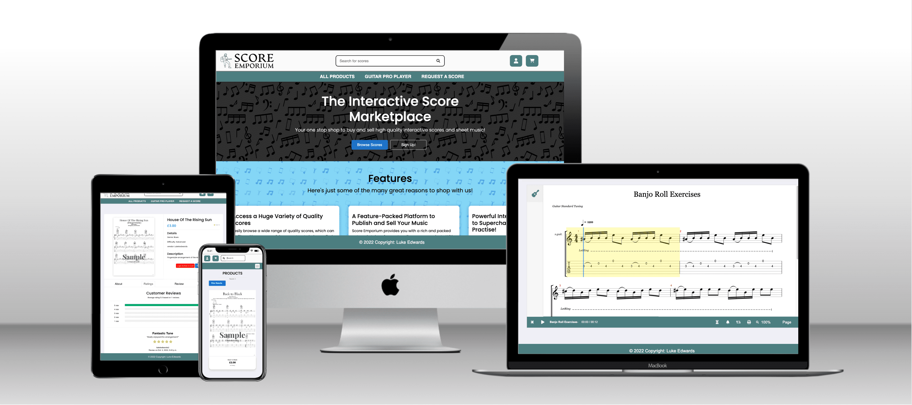

---

# Deployed Project

The deployed site can be viewed at: .

## Create an account

Much of the sites functionality requires a profile to access. Creating a profile is simple. Navigate to the 'sign up' page either via the navbar, or by clicking the button on the home page. Once there, enter your account details and password. You will then recieve a verification email to confirm your account. Other features of the site require 'vendor' status. You will be prompted to register as a vendor when attempting to first access these features. (Uploading a score, making a score request etc..)

## Guitar Pro and Pdf Files

To make use of the score player and upload a product features it is necessary to have an unlocked Guitar Pro file, and a PDF file.
I have taken the liberty of providing these. They can both be found [here]().

To use the Guitar Pro file, simply navigate to the 'Guitar Pro Player' via the navbar, then click the 'Choose File' button. The Guitar Pro file can then be selected to make use of the feature.

When adding a product to your store, simply select this Guitar Pro file as the 'Unlocked Guitar Pro' input, and select the PDF for the PDF field.

## Making a Purchase

This project is currently using Stripe in test mode for checkout features. To make a purchase use the following details:
* Card Number: 4242 4242 4242 4242
* Expiry: 04/24 242 42424

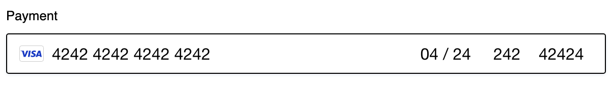

## **Project Overview**

The purpose of this project is to demonstrate my full-stack development skills by creating an e-commerce application using the Django framework and Stripe payments. 

### **Mandatory Requirements**:

* **Django Full Stack Project**: Build a Django project backed by a relational database to create a website that allows users to store and manipulate data records about a particular domain.

* **Multiple Apps**: The project must be a brand new Django project, composed of multiple apps.

* **Data Modeling**: Design a relational database schema well-suited for the domain.

* **User Authentication**: The project should include an authentication mechanism, allowing a user to register and log in, and there should be a good reason as to why the users would need to do so.

* **User Interaction**: Include at least one form with validation that will allow users to create and edit models in the backend.

* **Use of Stripe**: At least one of your Django apps should contain some e-commerce functionality using Stripe. This may be a shopping cart checkout or single payments, or donations, etc. After paying successfully, the user would then gain access to additional functionality/content on the site. Note that for this project Stripe's test functionality should be used, rather than actual live payments.

* **Structure and Navigation**: Incorporate a main navigation menu and structured layout.

* **Use of JavaScript**: The frontend should contain some JavaScript logic you have written to enhance the user experience.

* **Documentation**: Write a README.md file for the project that explains what the project does and the value that it provides to its users.

* **Version Control**: Use Git & GitHub for version control.

* **Attribution**: Maintain clear separation between code written by you and code from external sources (e.g. libraries or tutorials). Attribute any code from external sources to its source via comments above the code and (for larger dependencies) in the README

* **Deployment**: Deploy the final version to a hosting platform such as Heroku.

* **Security**: Make sure to not include any passwords or secret keys in the project repository. Make sure to turn off the Django DEBUG mode, which could expose secrets.

            
##  User Experience (UX)
---
### User Stories

- As a first time user I want to:

1. Quickly understand the purpose and layout of the site.
2. Understand how to create a profile and navigate the sites functionality.
3. Be able to customise my profile.
4. Be able to view products.
5. Use the integrated interactive score player.

- As a returning visitor I want to:

1. Be able to search for high quality scores by search terms.
2. Be able to filter scores based on a number of parameters.
3. Be able to purchase and view a library of my scores as both a PDF and interactive file.
4. View top performing scores through a review system.
5. Be able to request scores in a reddit style forum where the most popular posts rise to the top.

- As a Vendor I want to:

1. Be able to upload and sell my own scores.
2. Be able to view important sales data regarding income, growth, top performing products etc.
3. Customise my sales profile.
4. View trending score requests to help produce popular products.

## 1. Strategy
---
## Project purpose
- To provide a streamlined platform for musicians to both purchase and sell high quality interactive scores and PDF's
- To provide an interactive score player within the browser to improve the users learning experience.
- To provide a reddit style forum where users can make requests which vendors can then produce.

## 2. Scope
---
- I wanted a simple and intuitive user experience.
- I wanted all content to be displayed in a slick and aesthetic manner.
- I wanted a slick looking experience that functions well on a variety of screen sizes.
- I wanted a feature rich sales platform.
- I wanted a browser based interactive score system to play users uploaded or purchased scores.
- I wanted a comprehensive sales dashboard to provide sales metrics to users
- I wanted a reddit style voting system for users to request new scores. The most popular requests can then be voted to the top for vendors to produce.

## 3. Structure
---
- The site features a comprehensive navigation bar which allows the user to easilly traverse the entire sites functionality.
- Notifications for many important actions are built in to the website through toasts.
- The sites functionality is split accross several drop-down tabs in the main navbar.

    1. Two search bars allow the user to search for products through a variety of methods. This includes by title, Vendor and description.
    2. An account dropdown menu which allows the user to sign-in/out, view their store, purchased items, and sales dashboard.
    3. An all products link which returns all items on the website. This can then be further filtered by a variety of conditions.
    4. A user store section which allows the user access to their own profile in which they can change and update their information, change their profile picture, and add or edit products.
    5. A library of the users purchased scores.
    6. A section where users can request and view requests for popular scores.
    7. A sales dashboard which provides the user detailed information about their sales data. 

## 4. Skeleton 
---

### Wireframes

Wireframes were created for some of the main pages during the design phase using Figma, and can be accessed [here](./README_images/wireframes).

## 5. Surface 
---

### Colour Scheme
The colors used throughout the site are #4C7E80 for the navbar, footer and other elements, and White is also used for other portions of the navbar. #efeff6 is used as a background colour for every page. The buttons are all coloured using the bootstrap default colours; most notably btn-primary for any positive action, btn-danger for deleting or remove items, and btn-secondary for cancelling actions.

#### Colours used
* #efeff6 (Body background)
* #fafafa (navbar)
* #4C7E80 (navbar and footer)
* #68a0b0  (score request cards)
* #68a0b0  (score request cards)

### Typography
- The font family I used is 'Poppins' which is backed up by 'Sans Serif'.

### Imagery and Theme
- The imagery on the site is primarily related to music and scores. The hero image on the home page is a repeating pattern of musical notes below an animated overaly. I have also used cartoon SVG's in other areas. For example, the background image behind the features section of the home page is an image I created using icons of musical notes, tablets and computers. I also used a cartoon background image for the reviews section, and the allauth templates.

## 5. Features 
---
## General
---

### The Navbar

- The navbar alows the user to quickly traverse the site, and search for products. On smaller screens the navbar collapses into an animated burger icon, and the search bar becomes an animated button. 

### Notifications

- Most events on the website are accompanied by an informative toast pop-up to alert the user as to what is happening. These alerts are colour coded to immediately convey the nature of the notification.

<!-- add image of toast -->
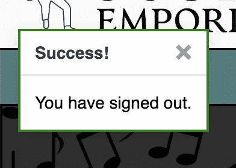

### Search Bar

- The site features two search bars; a full sized one on larger screens, and an expandable animated button on smaller screens. The search bar can be used to filter products by numerous parameters including name and description.

<!-- add image of both search bars -->
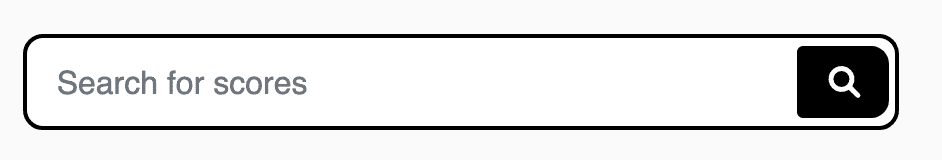

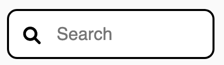

### Products

- The main products page provides a clear interface for navigating all products on the store. The products are presented as scores, with an information tab located at the foot of the item.

- The individual scores raise slightly when hovered to make it obvious to the user which item they are inspecting.

- The scores are fully responsive, with the number of items per row changing contextually based on the screen size.

<!-- add image of all products page -->
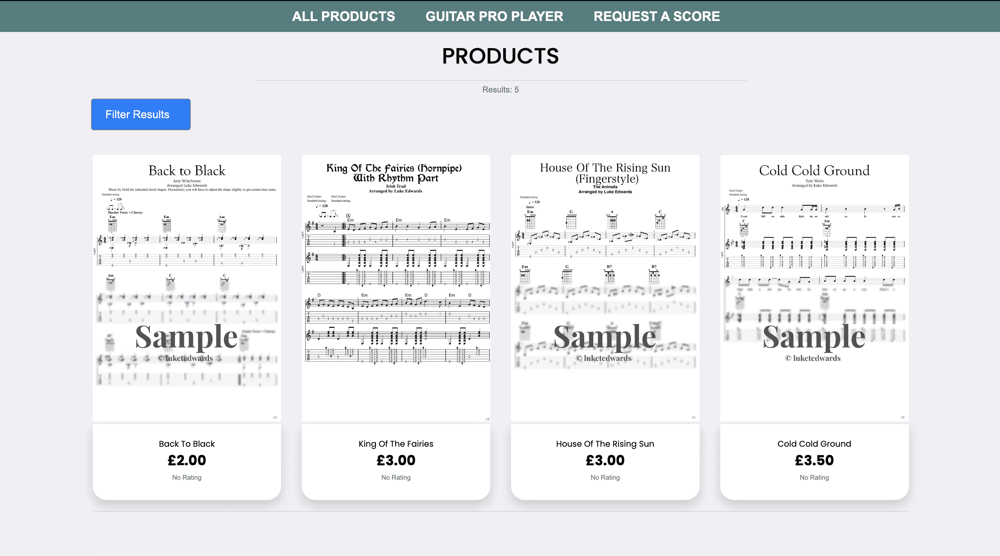

- Scores which are already owned by the user are clearly labelled as such. The rating of the product and it's price are also visible on the information footer.

<!-- add image of owned label -->
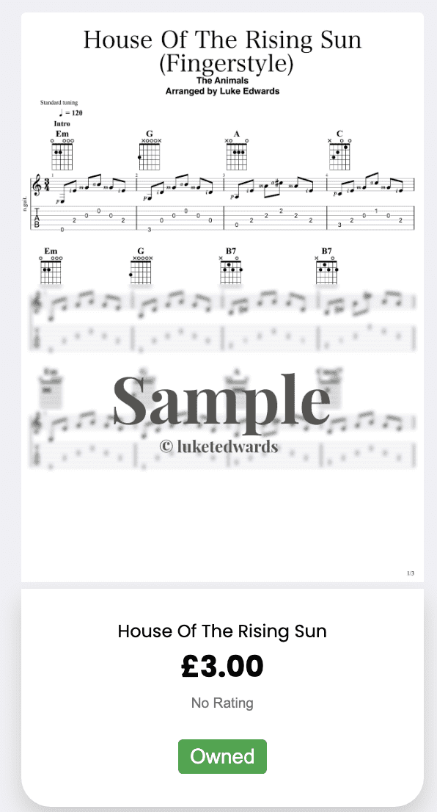

- The items on the products page can easilly be filtered by one or many parameters, using the compact filter button at the top of the page. Options include organizing by rating, price, and filtering by difficulty or genre.

<!-- add image of filter button  -->
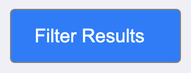
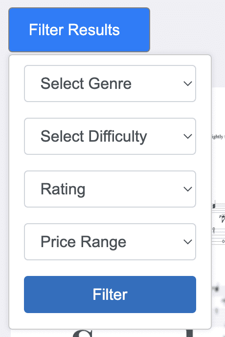

### Product Details 

- The details of an individual product are displayed in a compact manner on the 'product details' page. The page features two main sections; the item card which displays all information about the product being currently viewed, and the 'other products' section which presents other items from the vendors store.

- The top of the item card clearly displays relevant information about the product including an image, the name, price, vendor name and link, the rating, the genre and difficulty, and the description. This is then followed by the 'add to cart button' and 'keep shopping button'

#### Add to cart button

- The button to add items to the users cart is contextual based on a number of situations. If the user is not logged in, it instead prompts them to do so. If the product is the users own uploaded product, the item is already owned by the user, or the item is already in the current shopping cart, the button becomes disabled and clearly indicates the reason.
<!-- Photo of add to cart button -->
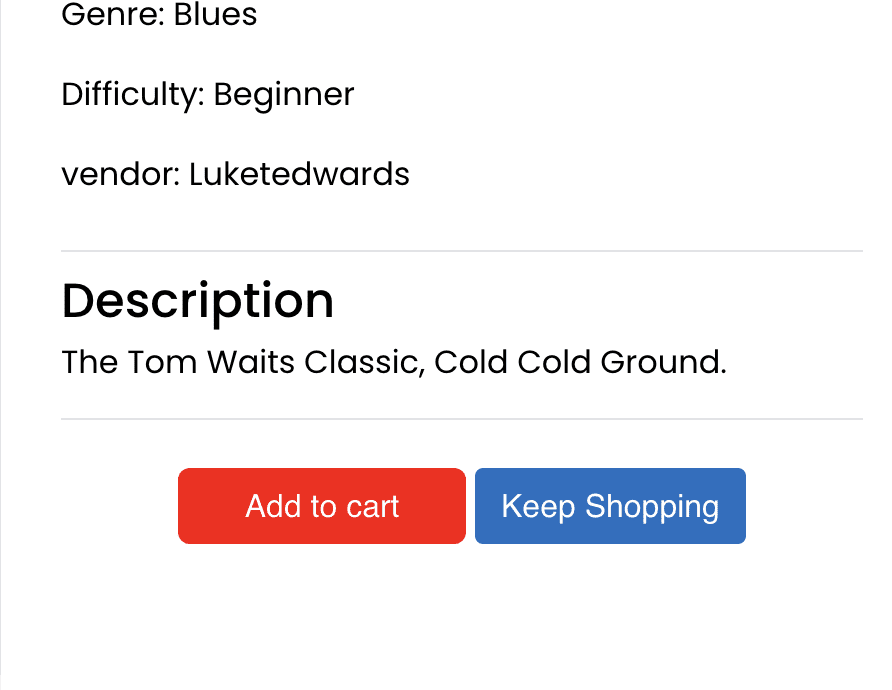
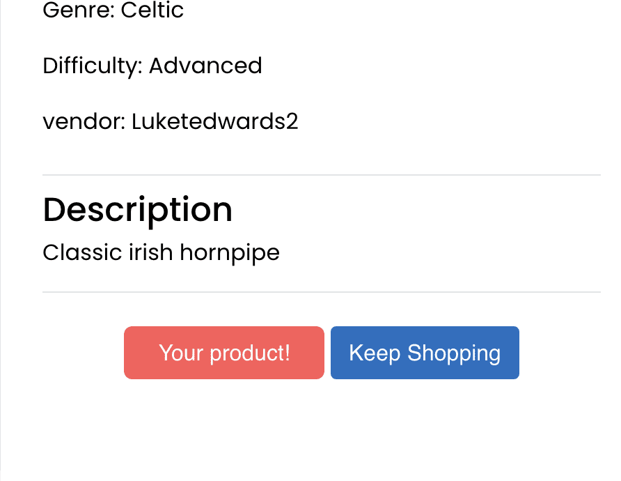

#### Item tabs

- The footer of the card consists of four tabs which compactly contain a variety of information.

1. The first tab displays the products description.
<!-- Photo of 1st tab -->
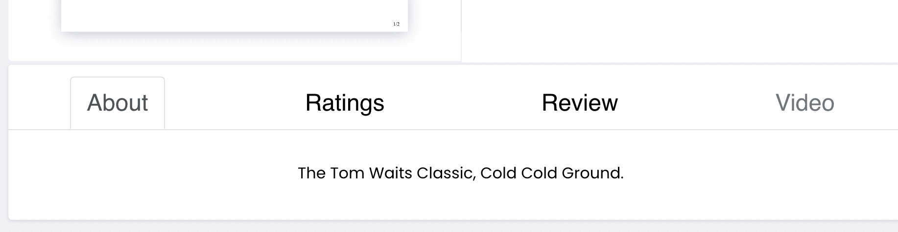

2. The second tab displays user ratings of the product along with a contextual bar graph displaying the total number of reviews, the overall rating, and the exact numbers of each level of rating. The bars programatically fill to the correct level based on the ratio of that star review. For example, if the item has 1 five-star review and 1 four-star review, the 5 star and 4 star bars will both fill to 50% and the overall rating will be 4.5 stars. Below this the actual content of the reviews is visible.
<!-- Photo of 2nd tab -->
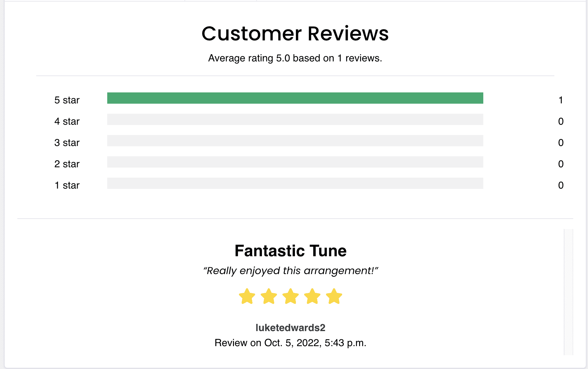

3. The third tab displays an animated form to leave a review. The submit button of this is contextual based on whether the item is owned or not, if the item is the product of the user, or if the user is not logged in. If the user has already submitted a review and decides to create a second one, the new review will simply updated the existing one.
<!-- Photo of 3rd tab -->
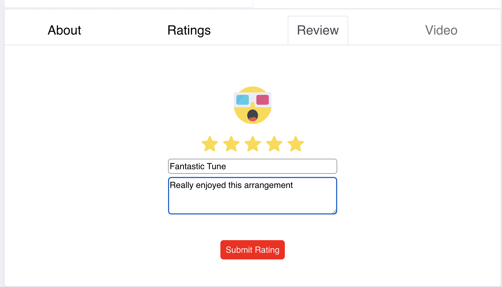
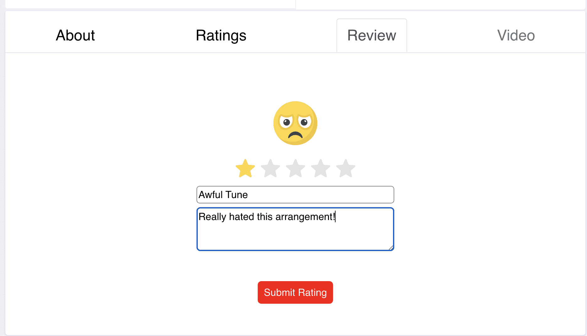

4. The fourth tab displays an iframe of a youtbe video if the vendor provided one. If not then this tab is disabled.
<!-- Photo of 4th tab -->
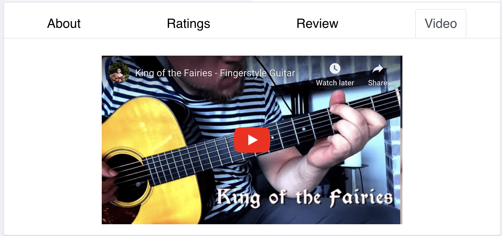

#### Other items section

- The section at the bottom of the page displays other products from the vendors store if there are any. 
- By hovering over an item the user is provided with two animated buttons to either view the product or add it to their cart. If the item is already owned, or added to the cart the user will be informed of this.
- Below each item a number of golden stars will be displayed based on the nearest integer to the products average rating.
<!-- Photo of other items section -->

### Storefront 
---
#### Users Storefront

- If the user is a vendor they will have access to the storefront section. This allows them to create and edit their products to sell on the site. 
- This area of the site also displays the users average rating, which is a number generated by averaging out all of the reviews across the users products. The users total number of sales is also displayed to help provide customers information to help guide them in thier purchases.
<!-- Photo of users storefront card -->
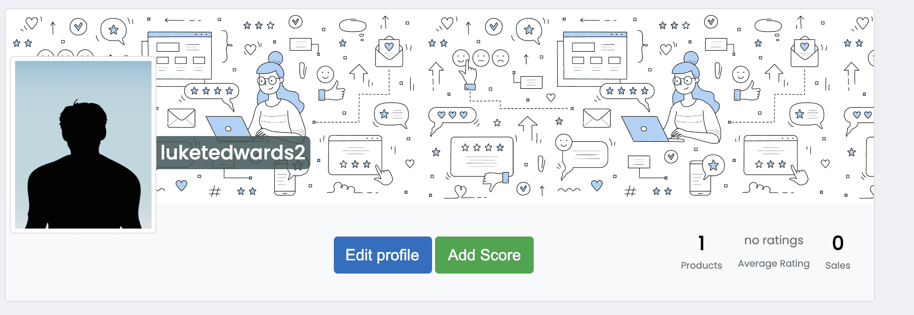
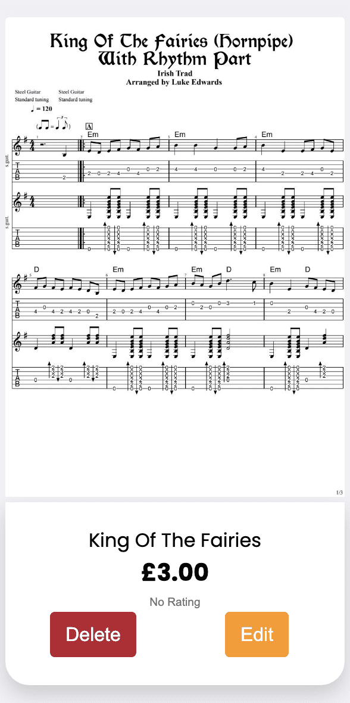

##### Adding a product

- Adding a product can be accessed by clicking the 'Add Score' button on the profile card at the top of the page.
- When adding a product the user is able to submit a wide variety of information inluding name, price, genre, difficulty, description, image, PDF, guitar pro file (both locked and unlocked) and a video link.
###### Thumbnail Generator
- If the user does not provide their own image of the product, the required PDF file will be processed to blur out the lower portion of the music so as not to give away too much of the score. The blurred image will then be watermarked with the vendors name and the text 'SAMPLE'. This image will then be automatically set as the product image.
<!-- Photo of generated thumbnail -->

##### Editing a product

- Editing a product works in a similar manner to uploading a product, and can be done via the 'edit' button below each item in the users storefront. 
- When editing, if the user changes the PDF file from the exisitng one and doesn't upload a new image, the new PDF will be processed in the same manner as before and will replace the current image with the newly updated one.

##### Deleting a product

- Deleting a product is as simple as editing one. Simply click the 'delete' button at the footer of the item card and a confirmation modal will be presented warning the user that the action is irreversible. If the second delete button is clicked the item is deleted, along with all of it's files from the S3 database.

##### Editing the users profile

- The user is able to edit their profile by clicking the 'Edit Profile' button at the top of the page.
- The user can then change a number of parameters inclding their profile photo, cover photo, bio, and bank account details for payments.

#### Other users storefront

- When the link for another user is clicked anywhere on the site, the user is taken to their storefront. This page acts in a similar way to the products page, but all of the products displayed are for the selected user. The vendors profile card is also visible at the top of the page displaying information such as their number of sales, overall rating and bio information.
<!-- Photo of other users storefront -->
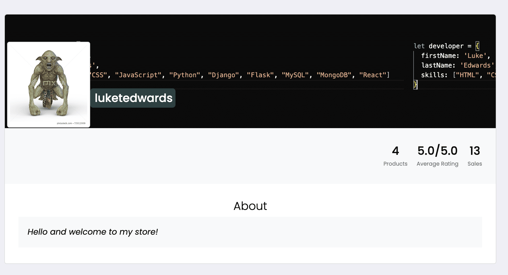

### Purchased Scores
---
- Once the user has purchase a score it will become available in the 'purhcased scores' library.
- All the purchased scores are layed out as cards in a responsive grid with information about the score on the front side of the card, such as title, price, purchase date and the image.
- When hovered the card flips to reveal download links for the PDF, and GP files, a link to play the score in the interactive score player, and a link to the product.
<!-- Photo of unflipped purchased scores-->
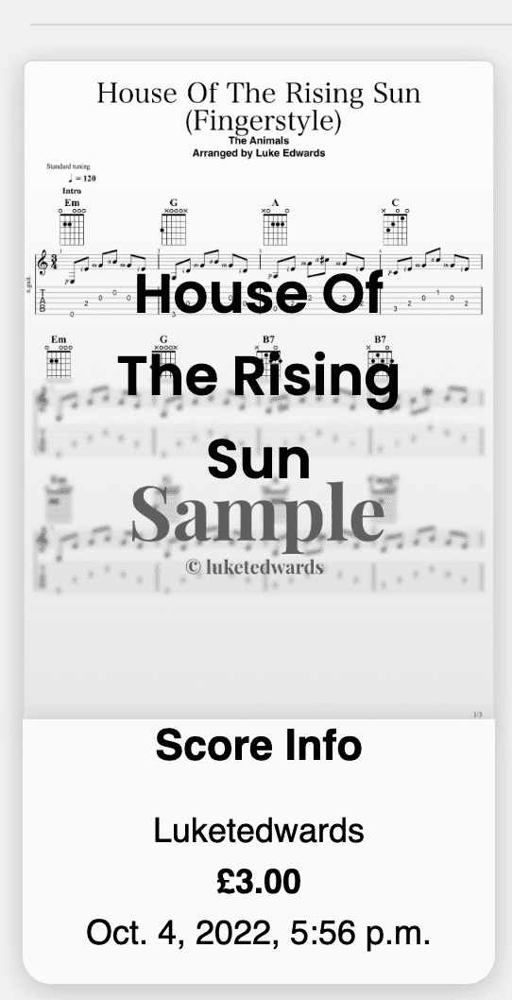
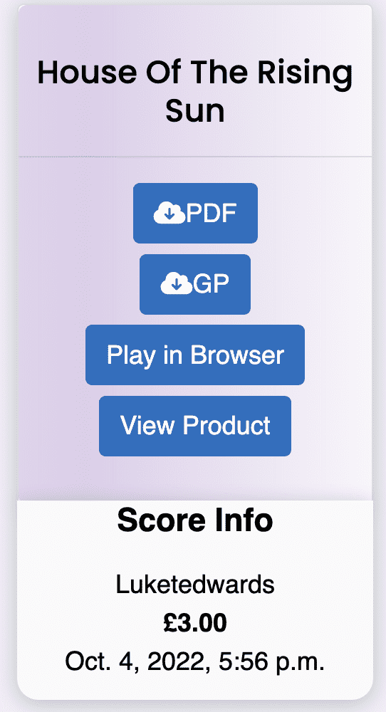

<!-- Photo of filpped purchased scores-->
### Sales dashboard
---
- a variety of useful sales metrics are available to vendors via the responsive 'sales dashboard'. 
- The dashboard features a clear interface displaying information such as number of customers, orders, revenue, revenue growth, orders growth and the users most popular genre of score. All of these are accompanied by a percentage statistic comparing the current figure to where it was the previous month.
- The dashboard also provides the user with todays orders and revenue compared with the previous week and the previous month.
- A table displays the vendors top 5 selling products along with their quantity sold and revenue generated.
- All of this data is intended to give the vendor insight as to which types of products are selling best, to guide them in providing future products.
<!-- Photo of dashboard feautres-->
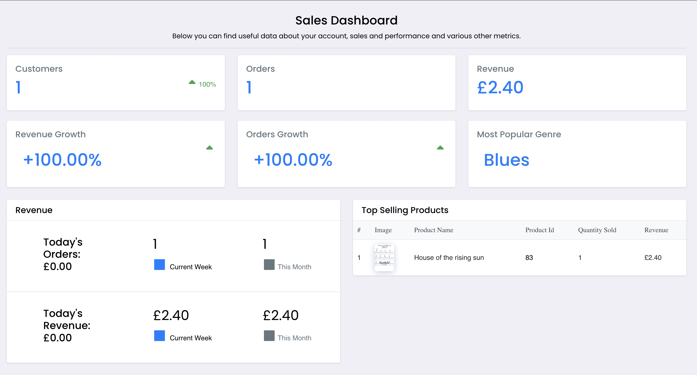

### Request a Score

- The request a score feature is intended to act in a similar way to sites like reddit. Users can make a request for a particular product, adding relevant information and video links. This post can then be seen by other users and vendors.
- A likes system allows users to like the posts they are interested in so that they rise to the top and become more popular. 
- A comment system allows community interaction with the posts.
- If a vendor would like to satisfy a post, they can upload a 'score submission' which features a message, a sample score and other related information. If the creator of the post is happy with the submission they can mark the post as complete, putting it in a new area and displaying the succesful submission. This will then draw attention to the product of the successful vendor.

#### Make a Request
- The make a request page allows authenticated users to create a request for a particular score or piece of music. This request is then visible to other users and vendors on the site.
<!-- Photo of make a request form-->
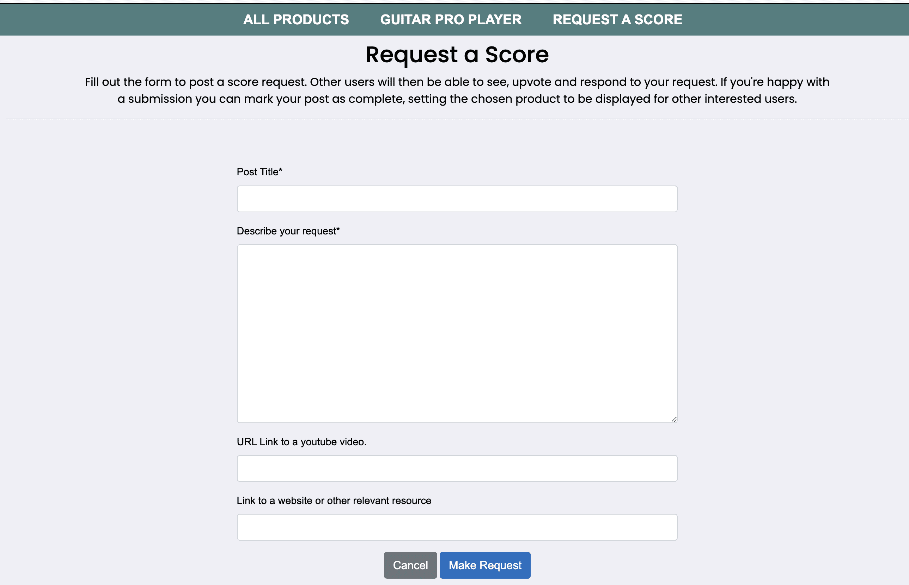

#### Trending Requests
- The trending requests page displays all active requests by users. The request is layed out in a responsve grid pattern as hoverable cards. The front face of the card displays basic information and a description, and the back face has relevant links, and action buttons.
<!-- Photo of front of request card-->
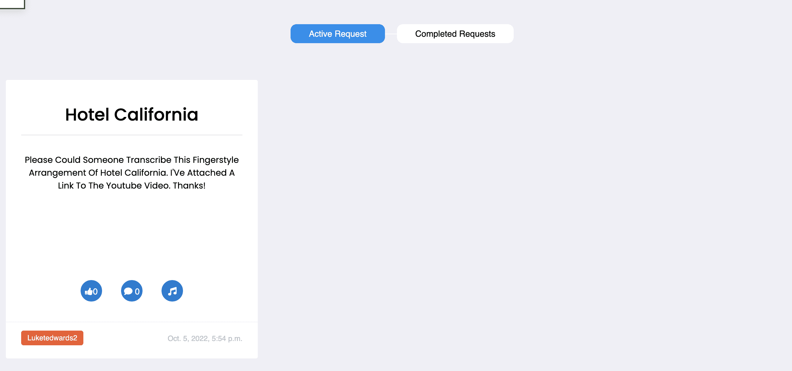

- The cards feature a likes and comments system, and are ranking by the number of likes a post has received. The idea is that the most popular requests rise to the top, and so are more likely to be fulfilled by a vendor.
<!-- Photo of back of request card-->
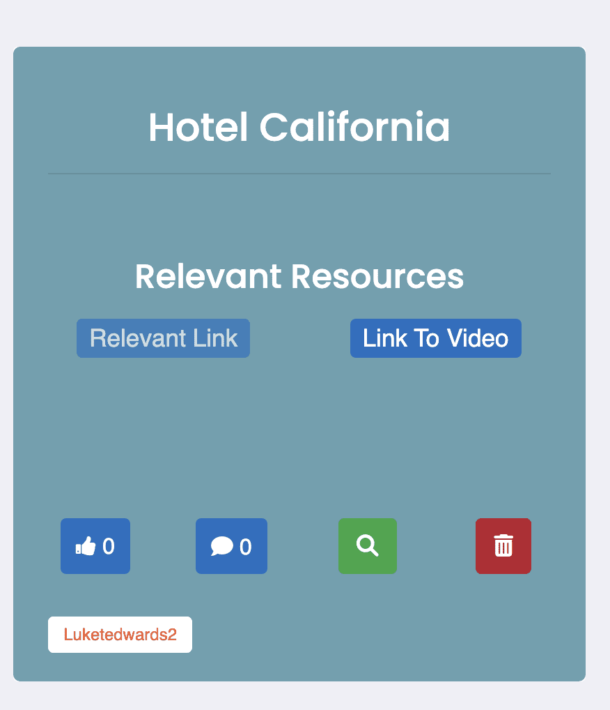

- The cards also features a score submission button if you are not the creator of the post. This allows you to upload files and messages which are visible to the creator. If the post belongs to you you are able to see submission which you can either accept or decline. 
<!-- Photo of score submissions-->
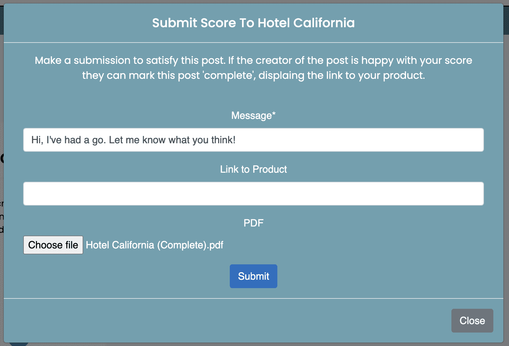
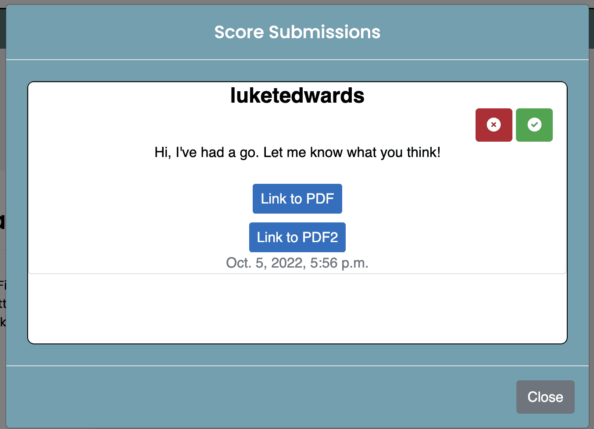

- Once a submisson has been accepted by the post creator, the post is moved to the 'completed' page tab. The card will now display the details of the successful submission, so that other interested users can purchase it.
<!-- Photo of completed request-->

### Guitar Pro Player
---
- One of the primary features of the website is the interactive score player. This player allows users to rendor a score in the browser and listen to the track. It also features a toggleable metronome, landscape and portrait modes, instrument switching, a count in button, a loop function, and many other options.
- The score player is based in [Alpha Tab](https://alphatab.net/docs/introduction) but has been customised and tweaked to work within my project.
- There are two permutations of the score player. The first one is accessible to any user regardless of authentication, and is accessible via the navbar. This allows the user to upload an unlocked Guitar Pro file from their computer, which is then rendered in the browser. If the user would like to change the file they can simply click the 'reload' button.
- The second version of the score player is accessible through the 'purchased scores' page. Once a user has purchased a score, they can press the 'play in browser' button to open the file in the interactive score player.
- The score player is responsive to screensize, and will become obscured by an overlay when the screen size is too small for the player to be practical.

<!-- Photo of score player-->
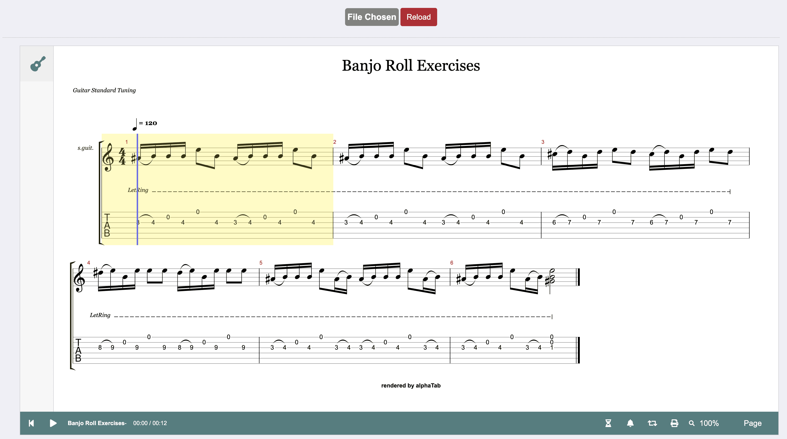

<!-- Photo of score player overlay-->
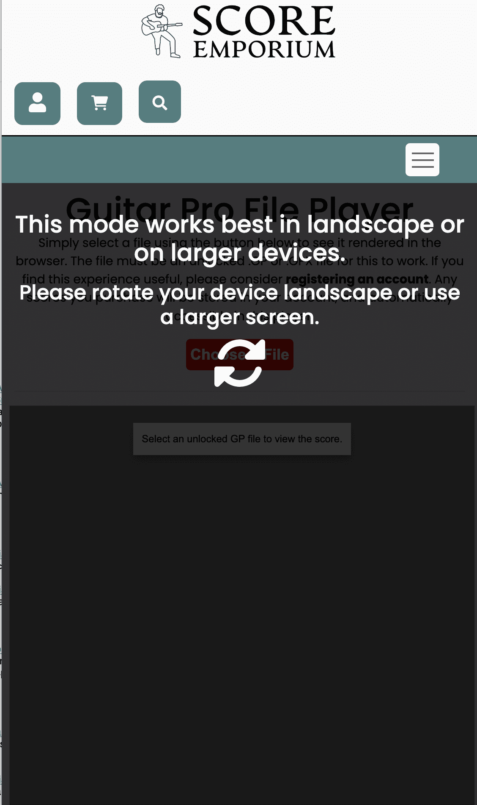

### Reviews
--- 
- The site features a reviews system which interacts with both the products and the product vendor. After purchasing a score the user is able to leave a review from the product details tab. This review is then linked to the product, and an average rating is generated for the item. 
- All reviews left on a vendors products are used to generate an average score which is then assigned to the vendors profile to help customers guage the overall quality of their products.
<!-- Photo of review form-->

<!-- Photo of review chart-->

### Emails
---

- When a product is purchased on the site, two different types of emails are generated and sent out. The first is an order confirmation email which is sent to the customer containing details about their order, order number, cost etc.
<!-- Photo of customer email-->
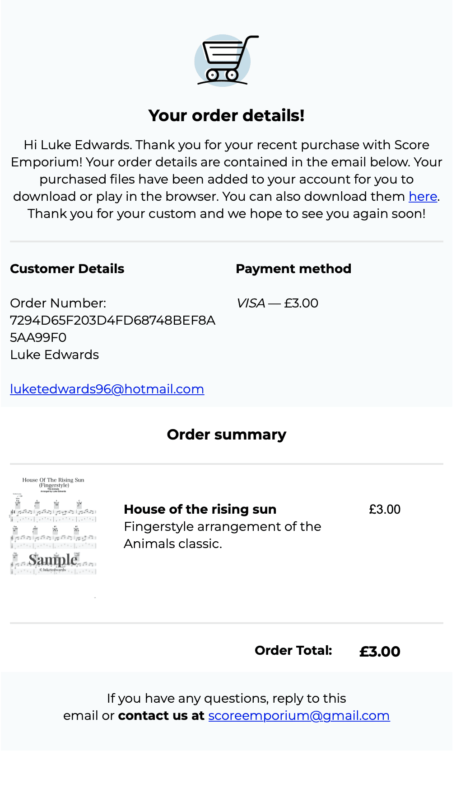

- The second email is a vendor sale notificaiton. This email is sent to each vendor who was involed in the sale, and only provides them the details of their contribution. For example if four products are purchased from a total of three vendors, two vendors will receive confirmation emails about the single product they have sold, and the third vendor will recieve an email detailing the two that they have sold.
<!-- Photo of vendor email-->
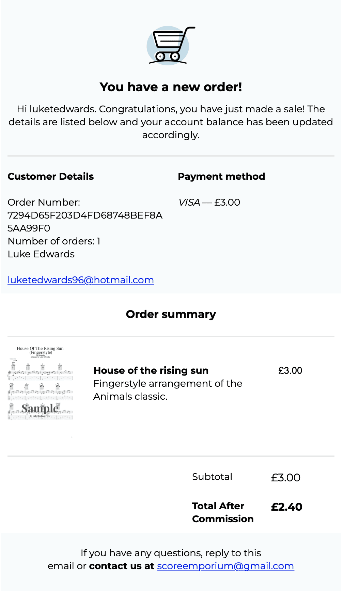

- When the sale completes, the site comission of 20% is deducted from the total sale, and the total after comission is credited to each vendors credit due. 
- The email template is styled and features both an image of a shopping cart, and the individual product images for the order.

## Technologies Used 
---

### Languages Used

* HTML5
* CSS3
* Javascript
* Python
* Django
* Stripe Payments
* Relational database using PostgreSQL

### Framework, Software & Libraries Used

1. [Bootstrap](https://getbootstrap.com/)
   * Bootstrap was used to quickly generate a responsive layout.

2. [Google Fonts](https://fonts.google.com/):
   * Google fonts was used to import the fonts used throughout the site..

3. [Font Awesome](https://fontawesome.com/):
   * Font Awesome was used to provide icons for various elements on the site.

4. [Git](https://git-scm.com/):
   * Git was used for version control to backup my project. I did this through terminal commands to commit to Git and push externally to GitHub.

5. [GitHub](https://github.com/):
   * GitHub was used to store all of my project code after being pushed from Git.

6. [Django](https://www.djangoproject.com/)
   * Django was used as the framework to create the project.

7. [Real Favicon Generator](https://realfavicongenerator.net):
   * Real Favicon Generator was used to create a favicon.ico file.

8. [Website Mockup Generator](https://websitemockupgenerator.com)
   * Website Mockup Generator was used to create the website mockup at the start of this README.

9.  [JQUERY](https://jquery.com)  
      * JQUERY was used throughout the process of creating my Javascript code.

10. [lighthouse](https://developers.google.com/web/tools/lighthouse)
      * Lighthouse was used to assess the performance of the project.

11. [Wave](https://wave.webaim.org/)
      * Wave was used to assess the accessibility of the project.

12. [Affinity Photo](https://affinity.serif.com/en-gb/photo/)
   * Affinity photo was used to create the website logo.

13. [Amazon S3](https://aws.amazon.com/s3/)
      * Amazon S3 was used to store all uploaded user files.    

14. [Stripe](https://stripe.com/en-gb)
   * Stripe API was used to accept the card payments on the website.

15. [pdf2image](https://pypi.org/project/pdf2image/)
   * Pdf2image was used to convert product pdfs into images which could then be manipulated by Pillow.

16. [Pillow](https://python-pillow.org/)
   * Pillow was used to crop, add a guassian blur and to write a watermark on images.

17. [boto3](https://boto3.amazonaws.com/v1/documentation/api/latest/guide/quickstart.html)
   * Boto3 was used to interface with Amazon S3.

18. [Heroku](https://heroku.com/)
      * Heroku was used to host my project.                      
             

## Further Testing
---
Details of testing can be found in the [Testing](/testing.md) file.

## Deployment
---

### **Heroku**
  Before you can deploy your app to Heroku, initialize a local Git repository and commit your application code to it.

  #### **Create a Heroku Remote**
  Git remotes are versions of your repository that live on other servers. You deploy your app by pushing its code to a special Heroku-hosted remote that’s associated with your app.

  #### **For a New App**:

  The heroku create CLI command creates a new empty application on Heroku, along with an associated empty Git repository. If you run this command from your app’s root directory, the empty Heroku Git repository is automatically set as a remote for your local repository.

      heroku create -a score-emporium

  You can use the "git remote -v" command to confirm that a remote named heroku has been set for your app.

  #### **For an Existing App**:

  Add a remote to your local repository with the heroku git:remote command. All you need is your Heroku app’s name:

      heroku git:remote -a score-emporium

  #### **Deploy Your Code**:
  To deploy your app to Heroku, use the "git push" command to push the code from your local repository’s main branch to your heroku remote. For example:

      git push heroku main

  Use this same command whenever you want to deploy the latest committed version of your code to Heroku.

  Heroku only deploys code that you push to the master or main branches of the remote. Pushing code to another branch of the heroku remote has no effect.

  ---

  ### **Forking the GitHub Repository**
  By forking the GitHub Repository you make a copy of the original repository on your GitHub account to view and/or make changes without affecting the original repository.

  You can do this by completing the following steps:

  1. Log in to GitHub and locate the GitHub Repository
  2. At the top of the Repository (not top of page) just above the "Settings" Button on the menu, locate the "Fork" Button.
  3. You should now have a copy of the original repository in your GitHub account.

  ---

  ### **Making a Local Clone**:
  1. Log in to GitHub and locate the GitHub Repository
  2. Under the repository name, click "Clone or download".
  3. To clone the repository using HTTPS, under "Clone with HTTPS", copy the link.
  4. Open Git Bash
  5. Change the current working directory to the location where you want the cloned directory to be made.
  6. Type git clone, and then paste the URL you copied in Step 3.

    $ git clone https://github.com/Luketedwards/score-emporium.git

 # Credits

## Code 
* Example code from [Alpha Tab](https://alphatab.net/docs/tutorials) was used to generate the interactive score player, before being heavily customised for the project.
*  Code from [Knyttneve](https://codepen.io/knyttneve/pen/EBNqPN) was used in creating the animated review form before altering it for the site.
* 

## Content

### Images
---
* The background image for the testimonial section was taken from [Freepik](https://www.freepik.com/free-vector/customer-review-rating-vector-doodle-concept_29314729.htm).
* The hero image on the home page was taken from [Shuterstock](https://www.shutterstock.com/image-vector/musical-notes-black-seamless-pattern-background-1315519904?irclickid=S-xRDpzx3xyNU4%3AWQ9W-nV6RUkDQzt0BA0VKVU0&irgwc=1&utm_campaign=TinEye&utm_medium=Affiliate&utm_source=77643&utm_term=).
* The background image used in the Allauth templates was taken from [Freepik](https://www.freepik.com/free-vector/account-concept-illustration_5464649.htm).

## Acknowledgements
---

* My mentor Rahul Lakhanpal for his support and invaluable advice throughout my project.

* Code Institute for their excellent learning platform and student support.

* [W3C Schools](https://www.w3schools.com/) and [Stack Overflow](https://stackoverflow.com/) for being valuable resources when I encountered problems in my code. 